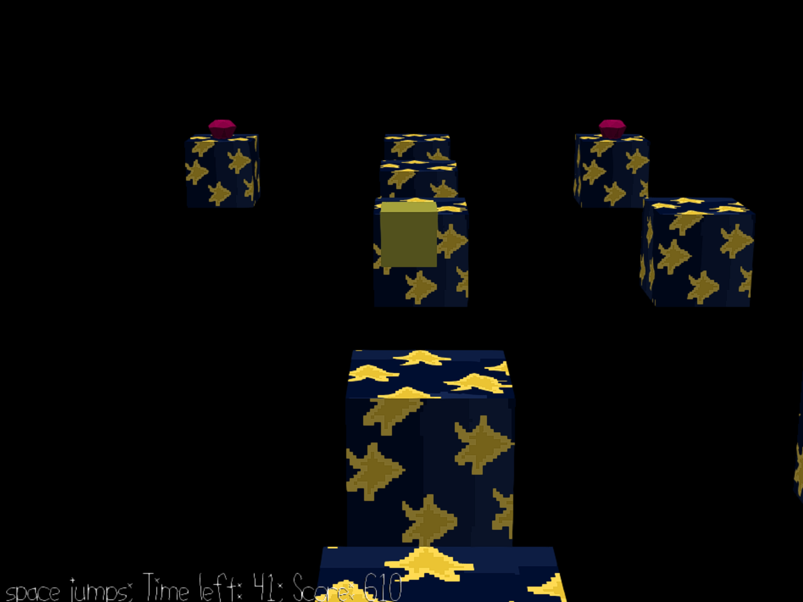

# A Stellar Jaunt

Author: Ben Cagan (bcagan)

Design: A short platformer, where you, as a plainly textured star, aim to get to the goal as quickly
as possible with the highest possible score (which can be increased by collecting gems). However, if
you don't jump to the rhythm, you won't get very far, you can only jump during a beat.

Screen Shot:

How To Play:

Move forwards/backwards with WS, left and right with AD, jump with space. A short
press of space will cause a short jump, while a longer hold will lead to a longer jump. You can only
jump whenever a beat is occuring, but can move at any time. If you try to jump during a beat, you will stay
on the ground (or fall off if you walk off a platform). The goal is to try to get to the, well, goal before the
time runs out, with the goal being the small golden orb on the right most platform. The more time you have
at the end remaining, the higher your score, and, if you collect any of the gems along the way, you will
get bonus points.

Sources: Music was made using https://www.beepbox.co/
Base Code

This game was built with [NEST](NEST.md).

